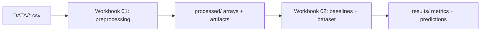

<div align="center">

# Towards Trustworthy AI in Financial Compliance  
X00195265 | Thesis Project

<!-- Badges (edit links/placeholders as needed) -->


</div>

---


## Abstract
Money laundering poses a major threat to global financial stability. Each year, up to 5% of global GDP, or €1.7 trillion, is laundered (UNODC, 2024), so financial institutions have to allocate vast resources to counter these illicit activities. In the EMEA region alone, compliance costs reached US$85 billion in 2023 (LexisNexis Risk Solutions, 2024). Despite these investments, Anti-Money Laundering (AML) systems continue to face challenges, including high false-positive rates and limited interpretability. 
While machine learning (ML) has improved classification accuracy, it is frequently applied to isolated transactions, neglecting the relational nature of financial crime. Graph Neural Networks (GNNs) offer a solution because they can model transactions as networks, preserving interactions over time steps. However, most current GNN models, like all complex models, lack transparency, which impedes their adoption in regulatory settings that require explainability and fairness.
This research proposes the design, implementation, and evaluation of an explainable GNN-based model for detecting illicit financial transactions using the Elliptic2 dataset (Bellei et al., 2024), developed by MIT CSAIL, IBM Watson AI Lab, and Elliptic. The primary focus is to explore how post-hoc and graph-specific explainability methods, such as SHAP, LIME, GNNExplainer, and Counterfactual-GNN, can improve the transparency and interpretability of GNN decisions in financial crimes detection. 
To support this goal, the study will include a preliminary bias analysis to examine whether the generated explanations differ across transaction types or network structures, helping to identify potential limitations in the transparency and fairness of the model’s reasoning.
In addition, a comparative evaluation against a traditional baseline model will be conducted to understand how graph-based representations affect both predictive accuracy and the interpretability of explanations. These supporting analyses will help contextualise the explainability results and clarify their practical relevance for financial compliance systems.


## Contents
- [Abstract](#abstract)
- [Scope and research objectives](#scope-and-research-objectives)
- [Dataset characteristics (Elliptic2)](#dataset-characteristics-elliptic2)
- [Repository layout](#repository-layout)
- [Workbooks overview](#workbooks-overview)
  - [01: Preprocessing and artifact generation](#01-preprocessing-and-artifact-generation)
  - [02: Baselines, dataset objects, and graph visualisation](#02-baselines-dataset-objects-and-graph-visualisation)
- [Environment setup (conda)](#environment-setup-conda)
- [How to run](#how-to-run)




## Scope and research objectives
This repository is structured around four research threads:
1. **Performance**: Compare GNN subgraph classification against traditional ML baselines under severe class imbalance.   
2. **Explainability**: Evaluate post-hoc explainers (feature-based and graph-native) for transparency and stability on AML subgraphs.   
3. **Bias / uneven treatment**: Probe whether prediction behaviour and explanation outputs differ across structural subgroups (e.g., size/density buckets).   
4. **Workflow integration**: Produce explanation outputs that can plausibly integrate into AML analyst decision-making.   


## Dataset characteristics (Elliptic2)
Elliptic2 is treated as a **subgraph-labelled** benchmark:
- `clId`: node / entity cluster identifier (graph vertex)
- `ccId`: connected-component identifier (one **subgraph instance**)
- `ccLabel`: supervision at the **component/subgraph** level (target for classification)

The workflow operates on the **labelled subgraph universe** (nodes/edges induced by labelled components) while sourcing node attributes from the much larger background graph.


## Repository layout
```
.
├── DATA/                      # NOT COMMITTED (raw Elliptic2 CSVs)
│   ├── nodes.csv
│   ├── edges.csv
│   ├── connected_components.csv
│   ├── background_nodes.csv
│   └── background_edges.csv
├── processed/                 # NOT COMMITTED (derived artifacts)
│   ├── parquet/
│   ├── artifacts/
│   └── arrays/
├── results/                   # metrics + predictions per run
├── notebooks/
│   ├── wb01_e2_preprocessing.ipynb
│   └── wb02_e2_baselinesAndGraphs.ipynb
├── requirements.txt
└── README.md
```


## Workbooks overview

### 01: Preprocessing and artifact generation
**Purpose:** Convert the Elliptic2 labelled subset into a reproducible, model-ready research state with strict integrity checks.

**Key operations**
- Locks schema (explicit column names) and validates inputs.
- Converts core CSVs → Parquet for iterative speed.
- Enforces referential integrity (edges closed over labelled nodes).
- Builds **subgraph labels** (`ccId → ccLabel`) and **component-level splits** (train/val/test).
- Extracts node features by subsetting `background_nodes.csv` to labelled `clId`s; produces `node_features.npy`.
- Computes train-only feature diagnostics for leakage-safe downstream scaling/analysis.

**Primary outputs**
- `processed/arrays/node_features.npy` : node features aligned to `nodes.csv` order  
- `processed/arrays/node_components.npy` : component membership per node  
- `processed/arrays/edge_index.npy` : global edge index in contiguous node space  
- `processed/artifacts/subgraph_labels.json` : `ccId → ccLabel`  
- `processed/artifacts/splits.json` : train/val/test component IDs  
- `processed/artifacts/feature_stats_train.json` : leakage-safe statistics  


### 02: Baselines, dataset objects, and graph visualisation
**Purpose:** Build credible baselines and a trainable dataset interface, plus structural diagnostics and visual intuition.

**Key operations**
- Loads Workbook 01 artifacts and core labelled CSVs.
- Computes component-level structural stats (`n_nodes`, `n_edges`, density proxies).
- Visualises representative subgraphs (small/medium/large) using NetworkX layouts.
- Packs nodes/edges by component into compact sampling arrays.
- Implements a lazy **PyTorch Geometric** dataset: one `Data` object per `ccId`.
- Verifies split hygiene (disjointness and coverage).
- Trains:
  - **Baseline A**: pooled node-feature model (mean/max/std pooling → logistic regression)
  - **Baseline B**: minimal **GraphSAGE** subgraph classifier (global pooling)

**Primary outputs**
- `processed/artifacts/packed/nodes_by_ccid.npz` : nodes grouped by component
- `processed/artifacts/packed/edges_by_ccid.npz` : intra-component edges grouped by component
- `results/baseline_tabular_metrics.json` : pooled-feature baseline metrics
- `results/baseline_gnn_metrics.json` : GraphSAGE baseline metrics


#### Baseline results (Wb02)


**Test prevalence (ground truth):** 553 suspicious out of 24,362 subgraphs → **2.27%** suspicious.  
This is a rare-event regime, so **PR-AUC + precision/recall** are the most informative metrics.

---

##### 1) Headline metrics (threshold selected on validation to maximise F1)

| Model | Test ROC-AUC | Test PR-AUC | Test F1 | Val best threshold |
|---|---:|---:|---:|---:|
| LogReg (pooled mean/max/std) | 0.890 | 0.154 | 0.251 | 0.865 |
| GraphSAGE (2-layer + mean pool) | **0.914** | **0.401** | **0.414** | 0.903 |

**Interpretation:** GraphSAGE improves **rare-class ranking** substantially (PR-AUC 0.154 → 0.401).


##### 2) Confusion matrix (test)

| Model | TN | FP | FN | TP |
|---|---:|---:|---:|---:|
| LogReg (pooled) | 22,920 | 889 | 346 | 207 |
| GraphSAGE | **23,392** | **417** | 300 | **253** |


##### 3) Operational rates (test)

| Model | Precision | Recall | False Positive Rate (FPR) | Alert rate (Predicted Positive %) |
|---|---:|---:|---:|---:|
| LogReg (pooled) | 18.9% | 37.4% | 3.73% | 4.50% |
| GraphSAGE | **37.8%** | **45.8%** | **1.75%** | **2.75%** |


  - **Precision**: “Of the alerts raised, what % are truly suspicious?”
  - **Recall**: “Of all suspicious cases, what % did we catch?”
  - **Alert rate**: “What % of all cases get flagged for review?”


##### 4) Improvement summary (GraphSAGE vs LogReg)

| Quantity | Change |
|---|---:|
| PR-AUC | **2.6× higher** (0.154 → 0.401) |
| F1 | **1.65× higher** (0.251 → 0.414) |
| Precision | **~2.0× higher** (18.9% → 37.8%) |
| Recall | **+8.4 pp** (37.4% → 45.8%) |
| False positives | **−53%** (889 → 417) |
| True positives | **+22%** (207 → 253) |
| Alert rate | **−39%** (4.50% → 2.75%) |

 Using graph structure (GraphSAGE message passing) produces a materially better AML screening model: higher hit-rate (precision), higher capture (recall), and far fewer false alarms.

---


## Environment setup (conda)
```bash
conda create -n elliptic2-xgnn python=3.11 -y
conda activate elliptic2-xgnn
pip install -r requirements.txt
```


## How to run
1. Place Elliptic2 CSVs in `DATA/`
2. Run **Workbook 01** end-to-end to generate `processed/`.
3. Run **Workbook 02** to produce baselines, diagnostics, and visualisations.
4. Track outputs in `results/` and keep artifacts under `processed/`.


